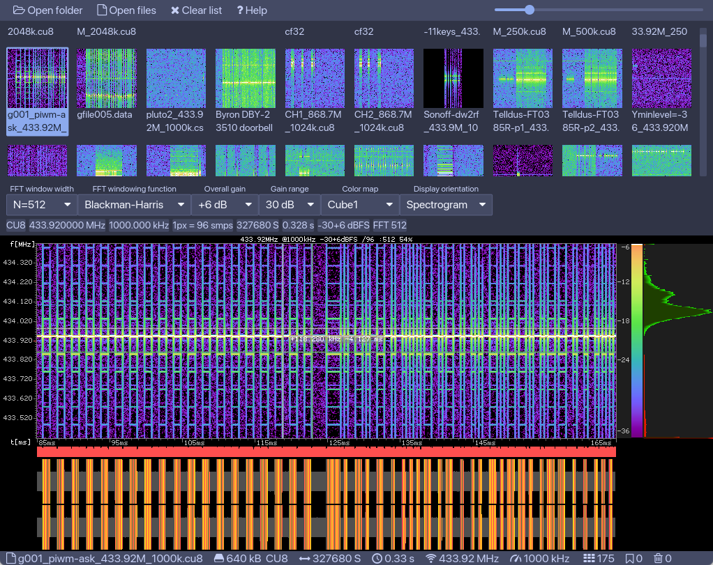

# IQViewer -- SDR I/Q data file viewer app

A somewhat minimal hack of an I/Q data file browser and viewer app.

| OS | Arch |
|---|---|
| Linux   | [x86_64](https://github.com/triq-org/iqviewer/releases/download/0.3/IQViewer-Linux-amd64.zip) &nbsp; [ARM64](https://github.com/triq-org/iqviewer/releases/download/0.3/IQViewer-Linux-arm64.zip) &nbsp; [ARMv7](https://github.com/triq-org/iqviewer/releases/download/0.3/IQViewer-Linux-armv7.zip)|
| NetBSD  | [x86_64](https://github.com/triq-org/iqviewer/releases/download/0.3/IQViewer-NetBSD-amd64.zip) |
| FreeBSD | [x86_64](https://github.com/triq-org/iqviewer/releases/download/0.3/IQViewer-FreeBSD-amd64.zip) |
| Windows | [x64](https://github.com/triq-org/iqviewer/releases/download/0.3/IQViewer-Windows-x64.zip) |
| macOS   | [intel + arm](https://github.com/triq-org/iqviewer/releases/download/0.3/IQViewer.dmg) |

Supports files and folders as CLI arguments and drag and drop of files and folders.

For ideas on more features, feedback and discussion see this [Issue](https://github.com/triq-org/iqviewer/issues/1)

## Supported file types
- `.cu4`,
- `.cs4`,
- `.cu8`, `.data`., `.complex16u`,
- `.cs8`, `.complex16s`,
- `.cu12`,
- `.cs12`,
- `.cu16`,
- `.cs16`,
- `.cu32`,
- `.cs32`,
- `.cu64`,
- `.cs64`,
- `.cf32`, `.cfile`, `.complex`,
- `.cf64`,
- `.sigmf`,

## Hotkeys

### Browser
- <kbd>o</kbd> → open files
- <kbd>O</kbd> → open dirs
- <kbd>x</kbd> → clear list
- <kbd>d</kbd> → mark file for delete
- <kbd>f</kbd> → mark file for move
- <kbd>D</kbd> → delete marked
- <kbd>M</kbd> → move marked
- <kbd>space</kbd> → open viewer
- <kbd>q</kbd> → quit app
- <kbd>s</kbd> <kbd>m</kbd> <kbd>l</kbd> → thumbnail size
- <kbd>h</kbd> → show help

## Viewer
- <kbd>esc</kbd> → close viewer
- <kbd>space</kbd> → close viewer
- <kbd>+</kbd> → zoom in
- <kbd>-</kbd> → zoom out
- <kbd>0</kbd> → reset zoom

## License

The AGPL 3.0 or later. Please see [license file](LICENSE) for more information.
